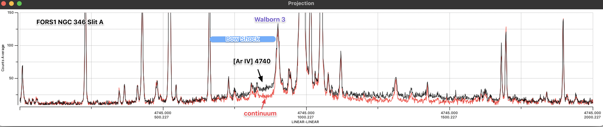

---
jupyter:
  jupytext:
    encoding: '# -*- coding: utf-8 -*-'
    formats: ipynb,py:light,md
    text_representation:
      extension: .md
      format_name: markdown
      format_version: '1.3'
      jupytext_version: 1.11.1
  kernelspec:
    display_name: Python 3
    language: python
    name: python3
---

<!-- #region -->
# Spatial profiles along slit from FORS1 spectra

I would like to achieve the following:

1. [X] Identify W 3 and the bow shock in the spectra
2. [X] Trace the full western extent of the bow shock in [Ar IV]
    - the MUSE field extends only 22 arcsec from the star
    - the FORS1 spectrum shows a roughly linear ramp that extends about 34 arcsec (see image below)
3. [X] Calculate the [O III] 4363/5007 temperature profile of the bow shock
    - See if there is any evidence for temperatures as high as the [Ar IV] temperature
4. [X] Measure the [Ne III] 3869 profile.  Ne$^+$ has the same ionization potential as Ar$^{+2}$ (40 eV), but [Ne III] seems to be much more broadly distributed than [Ar IV]





<!-- #endregion -->

```python
from pathlib import Path
import numpy as np
from matplotlib import pyplot as plt
import seaborn as sns
import regions
from astropy.io import fits
from astropy.wcs import WCS
import sys

sys.path.append("../lib")
import extract

sns.set_context("talk")
sns.set_color_codes()
```

Load line and continuum images for the two blue spectral ranges.  We may use the continuum for masking out regions that have excessive stellar contamination.

```python
hdu1 = fits.open("../data/ngc346-fors1-A-3500-4600-contsub.fits")[0]
hdu2 = fits.open("../data/ngc346-fors1-A-4400-6000-contsub.fits")[0]
hdu1c = fits.open("../data/ngc346-fors1-A-3500-4600-cont.fits")[0]
hdu2c = fits.open("../data/ngc346-fors1-A-4400-6000-cont.fits")[0]
```

```python
hdu1B = fits.open("../data/ngc346-fors1-B-3562-4600-contsub.fits")[0]
hdu2B = fits.open("../data/ngc346-fors1-B-4400-6000-contsub.fits")[0]
hdu1cB = fits.open("../data/ngc346-fors1-B-3562-4600-cont.fits")[0]
hdu2cB = fits.open("../data/ngc346-fors1-B-4400-6000-cont.fits")[0]
```

Set up the world coords for the two ranges

```python
wcs1 = WCS(hdu1)
wcs2 = WCS(hdu2)
wcs1B = WCS(hdu1B)
wcs2B = WCS(hdu2B)
for w in wcs1, wcs2, wcs1B, wcs2B:
    w.wcs.cdelt[1] *= -1.0
```

Set up the lines that we want with wavelength limits:

```python
pv1A = extract.PositionVelocityImage(hdu1.data, wcs1)
pv2A = extract.PositionVelocityImage(hdu2.data, wcs2)
pvc1A = extract.PositionVelocityImage(hdu1c.data, wcs1)
pvc2A = extract.PositionVelocityImage(hdu2c.data, wcs2)
pv1B = extract.PositionVelocityImage(hdu1B.data, wcs1B)
pv2B = extract.PositionVelocityImage(hdu2B.data, wcs2B)
pvc1B = extract.PositionVelocityImage(hdu1cB.data, wcs1B)
pvc2B = extract.PositionVelocityImage(hdu2cB.data, wcs2B)
```

```python
restwav = {
    "He II 4686": 4685.68,
    "[Ar IV] 4740": 4740.17,
    "[O III] 5007": 5006.84,
    "[O III] 4363": 4363.209,
    "[Ne III] 3869": 3869.07,
    "H I 4861": 4861.32,
    "H I 4340": 4340.463,
    "H I 4102": 4101.735,
    "He I 5876": 5875.62,
    "[Cl III] 5518": 5517.71,
    "[Cl III] 5538": 5537.88,
    "[N II] 5755": 5755.08,
    "[Fe III] 4658": 4658.10,
    "[Fe III] 4987": 4987.20,
    "[Fe III] 5270": 5270.4,
    "O II 4650": 4650.00,
    "[O II] 3729": 3728.815,
    "[O II] 3726": 3726.032,
    "Wing 4975": 4975.0,
}
```

```python
emlines = {k: extract.EmissionLine(k, v, vlim=(100.0, 400.0)) for k, v in restwav.items()}
```

```python
emlines
```

```python
for em in emlines.values():
    if em.wav0 > 4400:
        em.pvA = pv2A
        em.pvB = pv2B
        em.pvcA = pvc2A
        em.pvcB = pvc2B
    else:
        em.pvA = pv1A
        em.pvB = pv1B
        em.pvcA = pvc1A
        em.pvcB = pvc1B
```

```python
for em in emlines.values():
    em.A = em.pvA.slit_profile(em)
    em.ewA = em.pvA.slit_ew_profile(em, em.pvcA)
    em.cA = em.pvcA.slit_profile(em)
    em.B = em.pvB.slit_profile(em)
    em.ewB = em.pvB.slit_ew_profile(em, em.pvcB)
    em.cB = em.pvcB.slit_profile(em)
```

```python
fig, axes = plt.subplots(
    2,
    1,
    figsize=(12, 12),
    sharex=True,
)
e = emlines["[Ar IV] 4740"]
axes[0].plot(e.A.position, e.A.data, linewidth=1.0, alpha=1.0)
axes[1].plot(e.B.position, e.B.data, linewidth=1.0, alpha=1.0)

e = emlines["He II 4686"]
axes[0].plot(e.A.position, e.A.data, linewidth=2.0, alpha=1.0)
axes[1].plot(e.B.position, e.B.data, linewidth=2.0, alpha=1.0)

axes[0].axhline(0.0, linestyle="dashed", color="k")
axes[0].axvline(0.0, linestyle="dotted", color="k")

axes[1].axhline(0.0, linestyle="dashed", color="k")
axes[1].axvline(0.0, linestyle="dotted", color="k")

for ax in axes:
    ax.set(
        xlim=[-25, 75],
        ylim=[-30, 60],
    )
```

```python
fig, axes = plt.subplots(2, 1, figsize=(12, 12))
e = emlines["[O III] 5007"]
axes[0].plot(e.A.position, 1e-3 * e.A.data, linewidth=1.0, alpha=1.0)
axes[1].plot(e.B.position, 1e-3 * e.B.data, linewidth=1.0, alpha=1.0)

e = emlines["[O III] 4363"]
axes[0].plot(e.A.position, 0.075 * e.A.data, linewidth=1.0, alpha=1.0)
axes[1].plot(e.B.position, 0.075 * e.B.data, linewidth=1.0, alpha=1.0)

e = emlines["He II 4686"]
axes[0].plot(e.A.position, e.A.data, linewidth=2.0, alpha=1.0)
axes[1].plot(e.B.position, e.B.data, linewidth=2.0, alpha=1.0)

for ax in axes:
    ax.axhline(0.0, linestyle="dashed", color="k")
    ax.axvline(0.0, linestyle="dotted", color="k")
    ax.set(
        xlim=[-25, 75],
        ylim=[-30, 60],
    )
```

```python
Amask = emlines["[O III] 5007"].ewA.data > 250.0
Bmask = emlines["[O III] 5007"].ewB.data > 250.0

for e in emlines.values():
    e.multiA = e.A.multibin(kmax=10, mask=Amask)
    e.multiB = e.B.multibin(kmax=10, mask=Bmask)
    e.multi_cA = e.cA.multibin()
    e.multi_cB = e.cB.multibin()    
```


```python
e.multiB[512].data
```

Reddening correction for 4363 / 5007 from Mabel paper:

```python
redcorr_oiii_ratio = (7.06 / 522.70) / (6.82 / 534.12)
average_ratio_mabel = (7.06 / 522.70)
redcorr_oiii_ratio, average_ratio_mabel
```

```python
fig, axes = plt.subplots(2, 1, figsize=(12, 8), sharex=True, sharey=True)
e1 = emlines["[O III] 4363"]
e2 = emlines["[O III] 5007"]
# min, xmax = -10, 50
xmin, xmax = -230, 180

n = 2
ratioA = redcorr_oiii_ratio * e1.multiA[n].data / e2.multiA[n].data
ratioB = redcorr_oiii_ratio * e1.multiB[n].data / e2.multiB[n].data
posA = e1.multiA[n].position
posB = e1.multiB[n].position
axes[0].plot(posA, ratioA, linewidth=1.0, alpha=1.0, drawstyle="steps-mid")
axes[1].plot(posB, ratioB, linewidth=1.0, alpha=1.0, drawstyle="steps-mid")

n = 8
ratioA = redcorr_oiii_ratio * e1.multiA[n].data / e2.multiA[n].data
ratioB = redcorr_oiii_ratio * e1.multiB[n].data / e2.multiB[n].data
posA = e1.multiA[n].position
posB = e1.multiB[n].position
axes[0].plot(posA, ratioA, linewidth=4.0, alpha=1.0, drawstyle="steps-mid")
axes[1].plot(posB, ratioB, linewidth=4.0, alpha=1.0, drawstyle="steps-mid")

axes[0].plot(e2.A.position, 3e-7 * e2.A.data)
axes[1].plot(e2.B.position, 3e-7 * e2.B.data)

# axes[0].plot(e1.cA.position, 5e-7*e1.cA.data)
# axes[1].plot(e1.cB.position, 5e-7*e1.cB.data)

m = (posA > -50) & (posA < xmax)
average_ratioA = np.nanmean(ratioA[m])
m = (posB > -50) & (posB < xmax)
average_ratioB = np.nanmean(ratioB[m])

average_ratio = np.mean([average_ratioA, average_ratioB])

for ax, ratio in zip(axes, [ratioA, ratioB]):
    ax.axhline(0.0, linestyle="dashed", color="k")
    ax.axhline(
        average_ratio,
        linestyle="dotted",
        color="k",
    )
    ax.axvline(0.0, linestyle="dotted", color="k")
    ax.set(
        xlim=[xmin, xmax],
        ylim=[-0.003, 0.02],
    )
axes[-1].set(
    xlabel="Offset West from Walborn 3, arcsec",
    ylabel="[O III] λ4363 / λ5007",
)
sns.despine()
fig.tight_layout()
fig.savefig("../figs/ngc346-fors1-oiii-4363-5007-ratio.pdf")
```

```python
fig, axes = plt.subplots(
    2,
    1,
    figsize=(12, 8),
    sharex=True,
    sharey=True,
)
n = 16

e = emlines["He II 4686"]
fac = 1.0 / np.nanmax(e.multiA[n].data)
axes[0].fill_between(
    e.multiA[n].position,
    fac * e.multiA[n].data,
    linewidth=2.0,
    alpha=0.3,
    label=e.name,
)
axes[1].fill_between(
    e.multiB[n].position,
    fac * e.multiB[n].data,
    linewidth=2.0,
    alpha=0.3,
)

e = emlines["[O II] 3729"]
fac = 1.0 / np.nanmax(e.A.data)
axes[0].plot(
    e.A.position,
    fac * e.A.data,
    linewidth=2.5,
    alpha=1.0,
    drawstyle="steps-mid",
    color="b",
    label=e.name,
)
axes[1].plot(
    e.B.position,
    fac * e.B.data,
    linewidth=2.5,
    alpha=1.0,
    drawstyle="steps-mid",
    color="b",
)

e = emlines["[Ne III] 3869"]
fac = 1.0 / np.nanmax(e.A.data)
axes[0].plot(
    e.A.position,
    fac * e.A.data,
    linewidth=2.5,
    alpha=1.0,
    drawstyle="steps-mid",
    color="g",
    label=e.name,
)
axes[1].plot(
    e.B.position,
    fac * e.B.data,
    linewidth=2.5,
    alpha=1.0,
    drawstyle="steps-mid",
    color="g",
)

e = emlines["[Ar IV] 4740"]
fac = 1.0 / np.nanmax(e.multiA[n].data)
axes[0].plot(
    e.multiA[n].position,
    fac * e.multiA[n].data,
    linewidth=3.0,
    alpha=1.0,
    drawstyle="steps-mid",
    color="r",
    label=e.name,
)
axes[1].plot(
    e.multiB[n].position,
    fac * e.multiB[n].data,
    linewidth=3.0,
    alpha=1.0,
    drawstyle="steps-mid",
    color="r",
)


fac = 1.0 / np.nanmax(e.cA.data)
axes[0].fill_between(
    e.cA.position,
    fac * e.cA.data,
    linewidth=0.0,
    alpha=0.7,
    color="m",
    label="continuum",
)
axes[1].fill_between(
    e.cB.position,
    fac * e.cB.data,
    linewidth=0.0,
    alpha=0.7,
    color="m",
)


axes[0].axhline(0.0, linestyle="dashed", color="k")
axes[0].axvline(0.0, linestyle="dotted", color="k")

axes[1].axhline(0.0, linestyle="dashed", color="k")
axes[1].axvline(0.0, linestyle="dotted", color="k")

for ax in axes:
    ax.set(
        xlim=[xmin, xmax],
        ylim=[-0.1, 1.45],
    )

axes[0].legend()
axes[-1].set(
    xlabel="Offset West from Walborn 3, arcsec",
    ylabel="Relative Brightness",
)
sns.despine()
fig.tight_layout()
fig.savefig("../figs/ngc346-fors1-multiline-slit-profiles.pdf")
```

I want to combine the two previous plots to focus on only Slit A.

```python
import cmasher as cmr
fig, axes = plt.subplots(2, 1, figsize=(12, 8), sharex=True)

# Take 5 colors from rainforest in [0.15, 0.85] range in HEX
#colors = cmr.take_cmap_colors('cmr.rainforest', 5, cmap_range=(0.15, 0.85), return_fmt='hex')
colors = cmr.take_cmap_colors(
    'cmr.torch', 
    5, 
    cmap_range=(0.15, 0.85), 
    return_fmt='hex'
)


# Ratio plot
e1 = emlines["[O III] 4363"]
e2 = emlines["[O III] 5007"]
xmin, xmax = -230, 180

n = 1
ratioA = redcorr_oiii_ratio * e1.multiA[n].data / e2.multiA[n].data
posA = e1.multiA[n].position
axes[0].plot(
    posA, ratioA, 
    linewidth=0.2, color="k", alpha=0.5, 
    drawstyle="steps-mid",
)

n = 4
ratioA = redcorr_oiii_ratio * e1.multiA[n].data / e2.multiA[n].data
posA = e1.multiA[n].position
axes[0].plot(posA, ratioA, linewidth=4.0, alpha=1.0, color=colors[1], drawstyle="steps-mid")

m = (posA > -50) & (posA < xmax)
average_ratioA = np.nanmean(ratioA[m])

#axes[0].axhline(0.0, linestyle="dashed", color="k")
axes[0].axhline(
    average_ratio_mabel,
    linestyle="dotted",
    color="k",
)

axes[0].axvspan(
    2, 8,
    0.5, 0.7,
    linewidth=0.0,
    facecolor="k",
    alpha=0.2,
)

axes[0].axvline(0.0, linestyle="dotted", color="k")
axes[0].set(
    xlim=[xmin, xmax],
    ylim=[0.01, 0.022],
    ylabel="[O III] λ4363 / λ5007",
)


# Profile plot

n = 8
e = emlines["He II 4686"]
fac = 1.1 / np.nanmax(e.multiA[n].data)
axes[1].fill_between(
    e.multiA[n].position,
    fac * e.multiA[n].data,
    linewidth=1.0,
    alpha=1.0,
    color=colors[4],
    edgecolor="k",
    label=e.name,
    step="mid",
)

e = emlines["[O II] 3729"]
fac = 0.7 / np.nanmax(e.A.data)
axes[1].plot(
    e.A.position,
    fac * e.A.data,
    linewidth=2.5,
    alpha=0.6,
    drawstyle="steps-mid",
    color=colors[0],
    label=e.name,
)

e = emlines["[Ne III] 3869"]
e = emlines["[O III] 5007"]
fac = 1.4 / np.nanmax(e.A.data)
axes[1].plot(
    e.A.position,
    fac * e.A.data,
    linewidth=2.5,
    alpha=0.6,
    drawstyle="steps-mid",
    color=colors[1],
    label=e.name,
)


n = 16
e = emlines["[Ar IV] 4740"]
fac = 1.0 / np.nanmax(e.multiA[n].data)
axes[1].plot(
    e.multiA[n].position,
    fac * e.multiA[n].data,
    linewidth=3.0,
    alpha=1.0,
    drawstyle="steps-mid",
    color=colors[2],
    label=e.name,
)

n = 1
fac = 1.45 / np.nanmax(e.multi_cA[n].data)
axes[1].fill_between(
    e.multi_cA[n].position,
    fac * e.multi_cA[n].data,
    linewidth=2.0,
    alpha=1.0,
    color=colors[3],
    label="continuum",
    step="mid",
)


axes[1].axhline(0.0, linestyle="dashed", color="k")
axes[1].axvline(0.0, linestyle="dotted", color="k")

axes[1].set(
    xlim=[xmin, xmax],
    ylim=[-0.1, 1.45],
)
axes[1].legend()
axes[-1].set(
    xlabel="Offset West from Walborn 3, arcsec",
    ylabel="Relative Brightness",
)

for ax in axes:
    ax.minorticks_on()

sns.despine()
fig.tight_layout()
fig.savefig("../figs/ngc346-fors1-combo.pdf")
```

## Analysis of 4363 / 5007 ratio

```python
import pyneb as pn
o3 = pn.Atom("O", 3)
```

```python
o3.getTemDen(
    int_ratio=[average_ratio_mabel, 0.0145, 0.016, 0.022],
    den=100.0,
    wave1=4363,
    wave2=5007,
)
```

So that is rather small variation in temperature. including the ratios seen in the SNR sections. 

Define regions to take the nebular BG and the rise at the bow shock rim.

```python
e1 = emlines["[O III] 4363"]
e2 = emlines["[O III] 5007"]

pos_bg = [-6.0, -2.0]
pos_rim = [2.0, 8.0]
mask_bg = (e1.A.position >= pos_bg[0]) &  (e1.A.position <= pos_bg[1])
mask_rim = (e1.A.position >= pos_rim[0]) &  (e1.A.position <= pos_rim[1])
e1_rim_data = e1.A.data[mask_rim]
e2_rim_data = e2.A.data[mask_rim]
e1_bg_data = e1.A.data[mask_bg]
e2_bg_data = e2.A.data[mask_bg]
```
Do bootstrap resampling to find the uncertainty in the mean values:

```python
from astropy.stats import bootstrap
nboot = 100000
e1_rim_means = bootstrap(e1_rim_data, nboot, bootfunc=np.mean)
print("Standard error of mean: sigma/sqrt(n) = ", e1_rim_data.std() / np.sqrt(len(e1_rim_data)))
print("Standard deviation of bootstrap means: ", e1_rim_means.std())
print("The two numbers should be roughly the same")
```


```python
e2_rim_means = bootstrap(e2_rim_data, nboot, bootfunc=np.mean)
e1_bg_means = bootstrap(e1_bg_data, nboot, bootfunc=np.mean)
e2_bg_means = bootstrap(e2_bg_data, nboot, bootfunc=np.mean)
```

```python
from astropy import uncertainty as unc
```

Reserve the bare names `e1_rim`, etc. for the uncertainty distributions

```python
e1_rim = unc.Distribution(e1_rim_means)
e2_rim = unc.Distribution(e2_rim_means)
e1_bg = unc.Distribution(e1_bg_means)
e2_bg = unc.Distribution(e2_bg_means)

R_bg = e1_bg / e2_bg
R_bs = (e1_rim - e1_bg) / (e2_rim - e2_bg)
```

```python
print(f"BS 4363 / 5007 = {R_bs.pdf_mean():.4f} +/- {R_bs.pdf_std():.4f}")
print(f"BG 4363 / 5007 = {R_bg.pdf_mean():.4f} +/- {R_bg.pdf_std():.4f}")
```

Calculate ratio for T grid with pyneb, since it is more efficient to use linear interpolation for large numbers of ratios:

```python
Tgrid = np.linspace(5000.0, 30000.0, 251)
Rgrid = o3.getEmissivity(tem=Tgrid, den=100.0, wave=4363) / o3.getEmissivity(tem=Tgrid, den=100.0, wave=5007)
```

```python
T_bg = unc.Distribution(np.interp(R_bg.distribution, Rgrid, Tgrid))
T_bs = unc.Distribution(np.interp(R_bs.distribution, Rgrid, Tgrid))
```

```python
fig, ax = plt.subplots(figsize=(6, 4))
ax.hist(T_bg.distribution / 1000, bins=100, density=True, label="Background [O III]")
ax.hist(T_bs.distribution / 1000, bins=100, density=True, label="Bow shock [O III]")
ax.legend()
ax.set(
    xlabel="Temperature, kK",
    ylabel="Probability density, kK$^{-1}$",
    xlim=[11.9, 15.9],
)
sns.despine()
fig.tight_layout();
```

```python
from mpdaf.obj import Image
```

```python
im4740 = Image("../data/ngc346-ariv-4740-correct.fits")
im4711 = Image("../data/ngc346-ariv-4711-correct.fits")
im7263 = Image("../data/ngc346-ariv-7263-correct.fits")
im7171 = Image("../data/ngc346-ariv-7171-correct.fits")
```

```python
xslice, yslice = slice(230, 300), slice(144, 245)
def boot2dist(im, w, nboot):
    _data = im[yslice, xslice][20:60, 20:30].data.data
    _mask = im[yslice, xslice][20:60, 20:30].data.mask
    _w = w[yslice, xslice].data.data
    #_statfunc = lambda x: np.average(x, weights=_w[~_mask])
    _statfunc = np.mean
    return unc.Distribution(
        bootstrap(_data[~_mask], nboot, bootfunc=_statfunc)
    )
```

```python
nboot = 10000
weights = im4740 + im4711
i4740 = boot2dist(im4740, weights, nboot)
i4711 = boot2dist(im4711, weights, nboot)
i7263 = boot2dist(im7263, weights, nboot)
i7171 = boot2dist(im7171, weights, nboot)
```

```python
R1 = i4711 / i4740
R34 = (i7263 + i7171) / (i4711 + i4740)
R3 = i7263 / (i4711 + i4740)
R4 = i7171 / (i4711 + i4740)
```

```python
print(f"4711 / 4740 = {R1.pdf_mean():.4f} +/- {R1.pdf_std():.4f}")
print(f"7263 / (4711 + 4740) = {R3.pdf_median():.4f} +/- {R3.pdf_std():.4f}")
print(f"7171 / (4711 + 4740) = {R4.pdf_median():.4f} +/- {R4.pdf_std():.4f}")
```

```python
ar4 = pn.Atom("Ar", 4)
```

```python
e4711 = ar4.getEmissivity(tem=Tgrid, den=100.0, wave=4711)
e4740 = ar4.getEmissivity(tem=Tgrid, den=100.0, wave=4740)
e7263 = ar4.getEmissivity(tem=Tgrid, den=100.0, wave=7263)
e7171 = ar4.getEmissivity(tem=Tgrid, den=100.0, wave=7171)
R34grid = (e7263 + e7171) / (e4711 + e4740)
R3grid = e7263 / (e4711 + e4740)
R4grid = e7171 / (e4711 + e4740)
```

```python
T_R3 = unc.Distribution(np.interp(R3.distribution, R3grid, Tgrid))
T_R4 = unc.Distribution(np.interp(R4.distribution, R4grid, Tgrid))
```

```python
print(f"T([Ar IV] R3) = {T_R3.pdf_mean():.4f} +/- {T_R3.pdf_std():.4f}")
print(f"T([Ar IV] R4) = {T_R4.pdf_mean():.4f} +/- {T_R4.pdf_std():.4f}")
```

```python
fig, ax = plt.subplots(figsize=(7, 5))
ax.hist(T_bg.distribution / 1000, bins=100, density=True, label="Background [O III]", alpha=0.6)
ax.hist(T_bs.distribution / 1000, bins=100, density=True, label="Bow shock [O III]", alpha=0.6)
ax.hist(T_R3.distribution / 1000, bins=100, density=True, label="Bow shock [Ar IV] R3", alpha=0.6)
#ax.hist(T_R4.distribution / 1000, bins=100, density=True, label="Bow shock [Ar IV] R4", alpha=0.6)
ax.legend()
ax.set(
    xlabel="Temperature, kK",
    ylabel="Probability density, kK$^{-1}$",
    xlim=[11.9, 18.1],
)
sns.despine()
fig.tight_layout()
fig.savefig("../figs/ngc346-bowshock-T-oiii-ariv.pdf");
```

```python
dengrid = np.linspace(1.0, 5000.0, 1000)[::-1]
e4711d = ar4.getEmissivity(tem=14500, den=dengrid, wave=4711)
e4740d = ar4.getEmissivity(tem=14500, den=dengrid, wave=4740)
R1grid = e4711d / e4740d

```

```python
den_R1 = unc.Distribution(np.interp(R1.distribution, R1grid, dengrid))
```

```python
R1
```

```python
print(f"n_e([Ar IV] R1) = {den_R1.pdf_mean():.4f} +/- {den_R1.pdf_std():.4f}")

```

```python
fig, ax = plt.subplots(figsize=(7, 5))
ax.hist(den_R1.distribution, bins=100, density=True, label="$n_e$([Ar IV]) R1", alpha=0.6)
#ax.hist(T_R4.distribution / 1000, bins=100, density=True, label="Bow shock [Ar IV] R4")
ax.legend()
ax.set(
    xlabel="Density, cm$^{-3}$",
    ylabel="Probability density, cm$^{3}$",
    xlim=[0.0, 600.0],
    ylim=[0.0, 0.004],
)
sns.despine()
fig.tight_layout()
fig.savefig("../figs/ngc346-bowshock-den-ariv.pdf");
```

```python
R1
```

```python
(im4711[yslice, xslice].rebin(4) / im4740[yslice, xslice].rebin(4)).plot(vmin=1.0, vmax=2.0, colorbar="v")
```

```python
win4711 = im4711[yslice, xslice]
win4740 = im4740[yslice, xslice]

prof4711 = np.mean(win4711.data[20:60, :], axis=0)
prof4740 = np.mean(win4740.data[20:60, :], axis=0)
fig, ax = plt.subplots()

ax.plot(prof4711 / prof4740)
ax.plot((prof4711 + prof4740) / 400)
```

```python

```

## More graphs

```python
fig, axes = plt.subplots(2, 1, figsize=(12, 12))
n = 8
sA = {e.name: e.multiA[n].data for e in emlines.values()}
e = emlines["[O III] 5007"]
posA = e.multiA[n].position
sB = {e.name: e.multiB[n].data for e in emlines.values()}
e = emlines["[O III] 5007"]
posB = e.multiB[n].position

for ax, pos, s in zip(axes, [posA, posB], [sA, sB]):
    ax.plot(
        pos,
        s["[O III] 4363"]
        / s["[O III] 5007"]
        / np.nanmedian(s["[O III] 4363"] / s["[O III] 5007"]),
        linewidth=1.0,
        alpha=1.0,
        label="[O III] 4363 / 5007",
    )
    ax.plot(
        pos,
        0.15 + s["[Ne III] 3869"]
        / s["[O III] 5007"]
        / np.nanmedian(s["[Ne III] 3869"] / s["[O III] 5007"]),
        linewidth=1.0,
        alpha=1.0,
        label="[Ne III] 3869 / [O III] 5007",
    )
    ax.plot(
        pos,
        -0.3 + + s["He I 5876"] / s["H I 4861"] / np.nanmedian(s["He I 5876"] / s["H I 4861"]),
        #    0.1* s4341 / np.median(s4341),
        linewidth=1.0,
        alpha=1.0,
        label="He I 5876 / H I 4861",
    )
    ax.plot(
        pos,
        -0.15 + s["H I 4340"] / s["H I 4861"] / np.nanmedian(s["H I 4340"] / s["H I 4861"]),
        linewidth=1.0,
        alpha=1.0,
        label="Hγ / Hβ",
    )
    # ax.plot(positions, 0.0003 * s4686, linewidth=2.0, alpha=1.0)
    ax.axhline(0.0, linestyle="dashed", color="k")
    ax.axvline(0.0, linestyle="dotted", color="k")

    ax.legend(fontsize="x-small", ncol=2)
    ax.set(
        # xlim=[-10, 50],
        # xlim=[-230, 200],
        ylim=[0.4, 1.35],
    )
```

```python
posA[np.isfinite(posA)]
```

```python
fig, axes = plt.subplots(2, 1, figsize=(12, 6))
for ax, ew in zip(axes, ["ewA", "ewB"]):
    for line in "[O III] 5007", "H I 4861":
        p = getattr(emlines[line], ew)
        ax.plot(p.position, p.data, linewidth=3.0, alpha=1.0, label=line)
    ax.axhline(0.0, linestyle="dashed", color="k")
    ax.axvline(0.0, linestyle="dotted", color="k")
    ax.legend()
    ax.set(
        # xlim=[-10, 50],
        # ylim=[-0.003, 0.02],
    )
```

```python
fig, axes = plt.subplots(2, 1, figsize=(12, 6))
for ax, ew in zip(axes, ["ewA", "ewB"]):
    for line in "He I 5876", "[Ne III] 3869":
        p = getattr(emlines[line], ew)
        ax.plot(p.position, p.data, linewidth=3.0, alpha=1.0, label=line)
    ax.axhline(0.0, linestyle="dashed", color="k")
    ax.axvline(0.0, linestyle="dotted", color="k")
    ax.legend()
    ax.set(
        # xlim=[-10, 50],
        # ylim=[-0.003, 0.02],
    )
```

```python
fig, axes = plt.subplots(2, 1, figsize=(12, 6))
n = 16
for ax, multi in zip(axes, ["multiA", "multiB"]):
    for line in "[O III] 4363", "[N II] 5755":
        p = getattr(emlines[line], multi)[n]
        ax.plot(
            p.position, p.data / np.nanmax(p.data), linewidth=1.5, alpha=1.0, label=line
        )
    ax.axhline(0.0, linestyle="dashed", color="k")
    ax.axvline(0.0, linestyle="dotted", color="k")
    ax.legend()
    ax.set(
        # xlim=[-10, 50],
        ylim=[-0.05, 1.1],
    )
```

```python
fig, axes = plt.subplots(2, 1, figsize=(12, 12))
n = 32
for ax, multi in zip(axes, ["multiA", "multiB"]):
    for line in "[Fe III] 4658", "[Fe III] 4987", "[Fe III] 5270":
        p = getattr(emlines[line], multi)[n]
        scale = 100 / getattr(emlines["H I 4861"], multi)[n].data
        if "4987" in line:
            correct = getattr(emlines["Wing 4975"], multi)[n].data
        else:
            correct = 0.0
        ax.plot(
            p.position, scale * (p.data - correct), linewidth=1.5, alpha=1.0, label=line
        )
    ax.axhline(0.0, linestyle="dashed", color="k")
    ax.axvline(0.0, linestyle="dotted", color="k")
    ax.legend()
    ax.set(
        #        xlim=[-100, 50],
        xlim=[xmin, xmax],
        ylim=[-0.1, 1.5],
    )
```

```python

```
